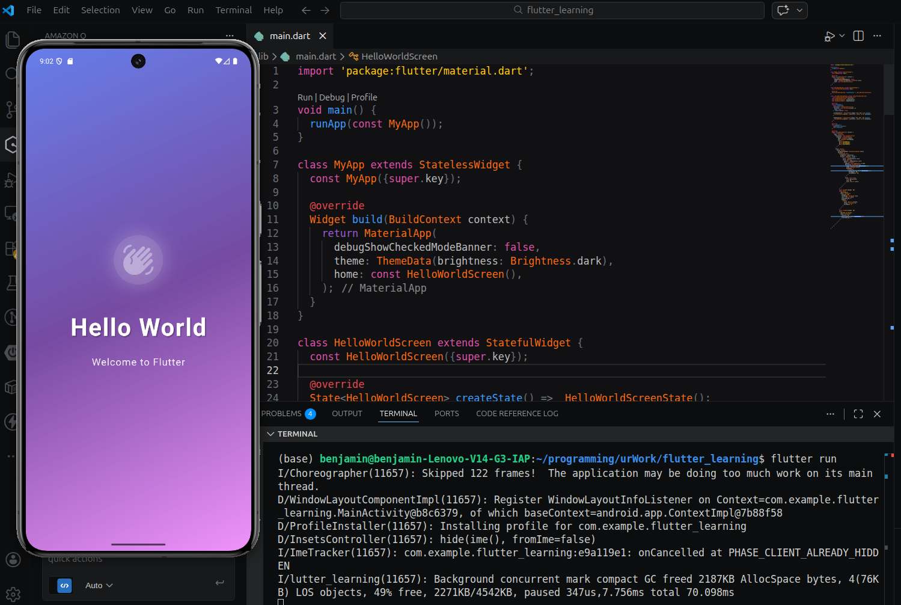

# flutter_learning

A Flutter learning project with an animated Hello World screen.

## Screenshot



## Features

- Animated waving hand icon
- Beautiful gradient background
- Smooth pulsing animations
- Modern UI design

## Getting Started

Run the app:

```bash
flutter run
```
