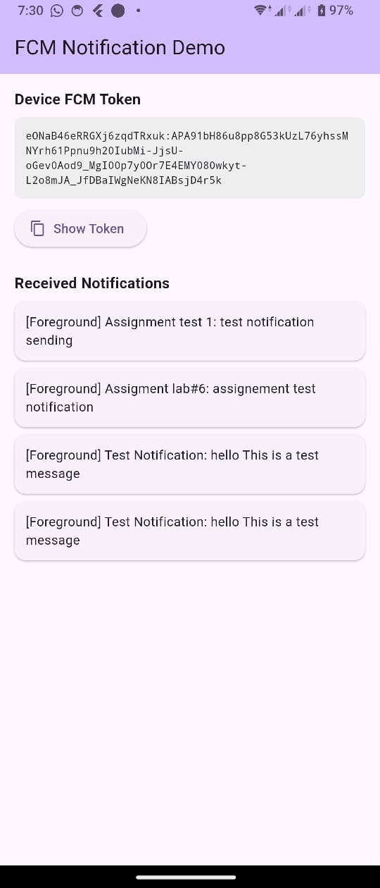
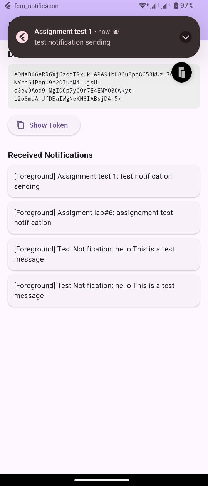

# FCM Notification — Flutter Lab 6

A Flutter application that integrates **Firebase Cloud Messaging (FCM)** to receive push notifications on a real Android device.

---

## Features

- Requests notification permission on launch (Android 13+ / iOS)
- Retrieves and displays the **FCM device token** on screen
- Receives and displays notifications in **three states**:
  - **Foreground** — app is open (shown as a local notification banner + listed in-app)
  - **Background** — app is running but minimized (system tray notification)
  - **Terminated** — app was closed (shown on system tray, recorded when app reopens)

---

## Screenshots

### App Screen — Token & Received Notifications
<p float="left">
  
  
</p>

### Firebase Console — Composing a Notification


### Firebase Console — Send Test Message (by FCM Token)


### Firebase Console — Target App Selection


### Firebase Console — Campaign History


---

## Project Structure

```
fcm_notification/
├── lib/
│   └── main.dart                  # Full FCM implementation
├── android/
│   ├── app/
│   │   ├── google-services.json   # Firebase config (auto-read by plugin)
│   │   ├── build.gradle.kts       # Google Services plugin + desugaring
│   │   └── src/main/
│   │       └── AndroidManifest.xml  # INTERNET + POST_NOTIFICATIONS permissions
│   └── settings.gradle.kts        # Google Services classpath
└── pubspec.yaml                   # Firebase + local notifications dependencies
```

---

## Setup

### 1. Prerequisites

- Flutter SDK installed
- Android device with USB debugging enabled
- Firebase project created at [console.firebase.google.com](https://console.firebase.google.com)

### 2. Firebase Configuration

The `google-services.json` file is already placed at:
```
android/app/google-services.json
```

It contains:
| Field | Value |
|---|---|
| Project ID | `mobile-lab6-e2d25` |
| Package name | `com.example.fcm_notification` |
| App ID | `1:709366880691:android:3a7e182292a0fc64e053c6` |

### 3. Install dependencies

```bash
flutter pub get
```

### 4. Run on a real device

```bash
flutter run
```

> FCM push notifications require a **real device** — they do not work on Android emulators (unless using Google Play emulator images).

---

## Dependencies

| Package | Purpose |
|---|---|
| `firebase_core` | Firebase initialization |
| `firebase_messaging` | Receive FCM push notifications |
| `flutter_local_notifications` | Show notification banners while app is in foreground |

---

## How to Send a Test Notification

1. Run the app on your device
2. Copy the **FCM Token** shown on the app screen
3. Go to **Firebase Console** → your project → **Cloud Messaging**
4. Click **New campaign** → **Notifications**
5. Fill in **Notification title** and **Notification text**
6. Click **Send test message**
7. Paste your device token → click **Test**
8. The notification will appear on your device instantly

---

## Android Configuration Details

| Setting | Value |
|---|---|
| `minSdk` | 21 (Flutter default — FCM compatible) |
| `compileSdk` | Flutter default |
| Core library desugaring | Enabled (required by `flutter_local_notifications`) |
| Gradle plugin | `com.google.gms.google-services:4.4.2` |

---

## Key Implementation Notes

- **Background handler** must be a **top-level function** annotated with `@pragma('vm:entry-point')` — Flutter isolate requirement
- `onMessage` → foreground messages (app is open)
- `onMessageOpenedApp` → user tapped a background notification
- `getInitialMessage()` → app was launched by tapping a notification from terminated state

---

## Lab Report

**Year 3 CSE — Lab 6 | Student ID: 223016911**

**Topic: Push Notifications with Firebase Cloud Messaging**

### Observations

- Firebase requires platform-specific config files for Android (`google-services.json`)
- FCM behaves differently depending on the app state (foreground / background / terminated)
- The FCM token is **unique per device** — it identifies the specific app installation
- Foreground notifications do **not** auto-display on Android; `flutter_local_notifications` is needed to show them as banners

### Key Steps Followed

1. Created a Firebase project in the Firebase Console
2. Registered the Android app using the application ID from `build.gradle.kts`
3. Downloaded and placed `google-services.json` in `android/app/`
4. Added `firebase_core` and `firebase_messaging` to `pubspec.yaml`
5. Configured Gradle files (project & app level) with the `google-services` plugin
6. Initialized Firebase in `main.dart` with `Firebase.initializeApp()`
7. Requested notification permission and retrieved the FCM token
8. Set up message handlers for all 3 app states (foreground, background, terminated)
9. Tested by sending a message from Firebase Console using the FCM token

### Handwritten Lab Notes

[View scanned lab notes (PDF)](pdf/CamScanner.pdf)

> Original handwritten observations and steps, scanned via CamScanner.
